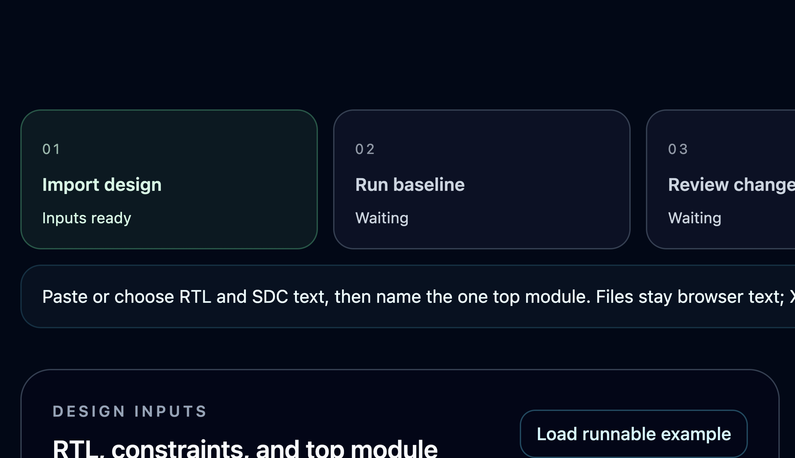

# XylonStudio

Xylon is a local OpenROAD timing assistant. Give it real RTL and SDC, a top module, and
one plain-language setup-timing request. It runs a bounded local OpenROAD flow on real RTL
and SDC, reads back measured evidence, and tells you the next action.

[繁體中文](README.zh-TW.md) · [Product site](https://xylonstud.io)



## Public site vs local app

`xylonstud.io` is a landing page only. It explains the supported OpenROAD timing
journey and shows product screenshots, but it does not expose the workbench,
OpenROAD runtime, or the timing APIs.

The actual local app is what you run from this checkout. Its operator surfaces
live at `/openroad` and `/pipeline` after `scripts/xylon start`.

## The first useful journey

1. Choose **Import a project bundle** to select a bounded multi-file RTL/SDC bundle, or load the included `sky130hd` timing example. Xylon stores only the selected text files inside its local workspace.
2. Ask: “Check setup timing, identify the worst path, and tell me how to improve it.”
3. Xylon validates the input and local resources before starting OpenROAD.
4. Review measured WNS, TNS, and the worst setup path.
5. If a violation exists, review one exact `PLACE_DENSITY 0.60 → 0.65` proposal.
6. Confirm it only if you want a candidate run, then compare the same metrics
   before and after.

### LibreLane execution boundary

Xylon v0.6 exposes a pinned LibreLane 3.0.10 backend path for an imported project.
It checks the local ARM64 image, Python environment, sky130A PDK, and available
resources before any EDA subprocess. When the gate is blocked, it records the first
blocker and gives one next action. The current `/openroad` workbench still uses the
existing ORFS comparison journey; the LibreLane API path is being wired into that
same user journey and is not presented as a completed native run until its readback
is available.

The supported paths behind that journey are:

- **Multi-file project import:** the workbench accepts `.v`, `.sv`, `.vh`, `.svh`, and `.sdc` files, checks the declared top module and clock before EDA, and refuses to start if any file changes after preflight.

- **Setup-timing assistant:** a local OpenAI-compatible model interprets one
  sentence. Deterministic tools validate RTL/SDC, run the built-in `sky130hd`
  recipe, read WNS, TNS, and the worst setup path, then prepare one bounded
  `PLACE_DENSITY 0.60 → 0.65` candidate when violations exist.
- **Human-controlled improvement:** the LibreLane API can create one expiring,
  hash-bound `PL_TARGET_DENSITY 0.60 → 0.65` proposal from a negative native WNS
  baseline. The exact proposal ID and explicit approval are required before an
  isolated candidate rerun; the response compares native metrics before and after.
- **RTL verification:** pinned Verilator lint, optional independent C++
  self-check, measured coverage, optional Yosys structure, and a checksummed
  exact-rerun bundle.
- **Advanced OpenROAD MCP records:** a separate restricted MCP runtime remains
  available for bounded diagnostics. It is not evidence for the timing journey.

The model never receives RTL, SDC, timing metrics, raw logs, or a confirmation
tool. Measured facts come only from OpenROAD readback. The first release accepts
only literal loopback model endpoints (`127.0.0.1` or `::1`), follows no
redirects, and accepts no API key.

## Start Xylon

Requirements: Python 3.11+, Node.js 22+, Docker, and at least 8 GiB of currently
available memory. A 16 GiB or larger machine is recommended.

```bash
python3 -m venv agent/venv
agent/venv/bin/python -m pip install --require-hashes -r requirements.lock

cd web
npm ci
npm run build
cd ..

scripts/xylon-openroad install
scripts/xylon doctor
scripts/xylon start
```

Open [http://127.0.0.1:3000/openroad](http://127.0.0.1:3000/openroad).

For an Ollama-compatible local setup, start the server in one terminal:

```bash
ollama serve
```

Then list installed models in another terminal:

```bash
ollama list
```

Use `http://127.0.0.1:11434/v1` and the exact name of one installed chat model.
The page can test that model connection without sending RTL, SDC, or starting
OpenROAD. Xylon does not download or silently select a model.

1. Start a model server that supports the OpenAI chat-completions API on loopback.
2. Load the runnable timing example or paste bounded RTL and SDC.
3. Enter the loopback endpoint and an installed model name, then test the model connection.
4. Ask: “Check setup timing, identify the worst path, and tell me the next
   improvement step.”
5. Review measured WNS/TNS and the exact proposal. Confirm only if you want one
   candidate run.
6. Explicitly ask the assistant to execute the confirmed change, or use the
   dedicated candidate button. Status and explanation requests never start EDA.

## When OpenROAD cannot start

Timing runs started through one Xylon API process are serialized and resource-gated.
Direct CLI timing and the separate MCP runtime are independent entry points; do not
run them concurrently until Xylon reports a shared host-wide lease. Each timing run
uses one CPU by default, an 8 GiB memory cap, no container network, and exact-owner
cleanup. If capacity is below the safety floor, the workbench remains available but
Xylon does not start OpenROAD. Close or wait for other heavy work, then run:

```bash
scripts/xylon doctor
scripts/xylon-openroad doctor
```

Your design input and saved results remain intact.

Manage only the stack owned by this checkout:

```bash
scripts/xylon status
scripts/xylon logs --tail 100
scripts/xylon stop
```

## Current boundary

| Implemented in this build | Not available |
| --- | --- |
| Bounded RTL/SDC setup timing on built-in `sky130hd` | Arbitrary PDK or library import |
| WNS, TNS, worst max path, and cleanup readback | Hold, multi-corner, power, area, DRC/LVS, or signoff claims |
| One evidence-bound placement-density candidate API path | General autonomous OpenROAD command execution |
| Loopback OpenAI-compatible intent model | Remote BYOK endpoints or stored API keys |
| Local confirmation gesture bound to one proposal | Authenticated user identity or approval audit |

An improved candidate is not timing closure. A clean reported setup boundary is
not physical signoff or tape-out readiness. Missing, stale, failed, interrupted,
or inconclusive evidence never becomes a completed stage.

## Interfaces

- `/openroad` — natural-language timing assistant, timing workbench, and
  collapsed advanced MCP diagnostics.
- `/pipeline` — RTL verification.
- `POST /api/assistant/timing` — loopback-model intent plus deterministic timing
  orchestration; there is no confirmation tool.
- `/api/timing/runs/*` — typed baseline, status, proposal, confirmation, and
  candidate endpoints.
- `/api/openroad/librelane-project-runs/*` — pinned LibreLane preparation,
  approved baseline execution, bounded repair proposal, and candidate comparison.
- `POST /api/openroad/projects` and `POST /api/timing/project-runs` — bounded
  project import, revalidation, and timing start from a local project ID.
- `GET /api/openroad/snapshot` — read-only MCP execution record.

See [API contract](docs/API.md), [security boundary](SECURITY.md), and
[contribution rules](CONTRIBUTING.md).

## Verify a change

Run resource-sensitive checks serially:

```bash
agent/venv/bin/python -m pytest -q agent/tests
agent/venv/bin/ruff check agent

cd agent/openroad && npm test && cd ../..
cd web
npm run test:contracts
npm run build
npm run type-check
npm run lint
```

Offline tests prove contracts only. Real EDA and user-journey claims additionally
require exact-revision runtime readback, a failure path, cleanup evidence,
independent review, and protected CI.

Python direct and transitive dependencies are hash-locked and audited in the
verification gate. The runtime base image and EDA source commits are pinned.
Debian packages and Git sources are still fetched from upstream during image
build, so fully snapshot-pinned image provenance remains an explicit security
gap.

## License

[MIT](LICENSE)
