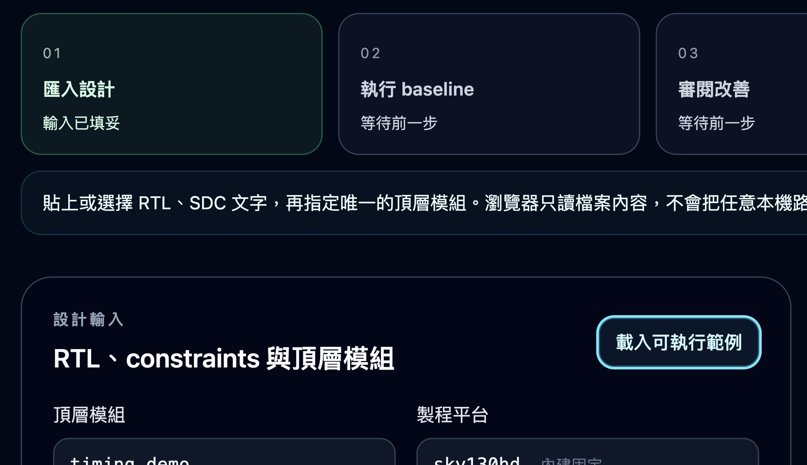

# XylonStudio

Xylon 是在本機執行的 OpenROAD 時序助理。提供真實 RTL、SDC、頂層模組，再用一句話
描述 setup 時序需求；Xylon 會執行受限流程，讀回實測證據，並告訴你下一步。

[English](README.md) · [產品網站](https://xylonstud.io)



## 公開網站與本機程式

`xylonstud.io` 目前只提供 landing page，用來說明支援的 OpenROAD 時序流程與展示產品畫面；
它不提供工作台、OpenROAD 執行環境或 timing API。

真正可操作的本機程式仍然來自這個 checkout。執行 `scripts/xylon start` 後，操作入口
會出現在 `/openroad` 與 `/pipeline`。

## 第一個實用流程

1. 選擇「匯入多檔專案」一次載入受限的 RTL／include／SDC 檔案，或載入內建 `sky130hd` 時序範例。Xylon 只會把選取的文字檔保存到自己的本機工作區。
2. 輸入：「檢查 setup 時序、找出最差路徑，並告訴我怎麼改善。」
3. Xylon 會先驗證輸入與本機資源，通過後才啟動 OpenROAD。
4. 查看實測 WNS、TNS 與最差 setup 路徑。
5. 若有違規，審閱一個確切的 `PL_TARGET_DENSITY 0.60 → 0.65` 提案。
6. 只有確定要跑 candidate 才確認；完成後比較相同指標的前後差異。

### LibreLane 執行流程

Xylon v0.6 已建立固定版本的 LibreLane 3.0.10 後端介面。系統會先檢查本機
ARM64 映像檔、Python、sky130A PDK 與可用資源；任何一項不符合時，只顯示
第一個阻塞原因，不會啟動 EDA。目前 `/openroad` 工作台仍使用既有的 ORFS
比較流程；LibreLane API 正在接回同一條使用者流程，沒有讀回原生結果前，
不會把它說成已完成的 LibreLane 工作。

支援這個流程的功能包括：

- **多檔專案匯入：**工作台接受 `.v`、`.sv`、`.vh`、`.svh` 與 `.sdc`，會在啟動 EDA 前檢查頂層模組與 clock；preflight 後只要檔案被改動，就會拒絕啟動並要求重新匯入。

- **Setup 時序助理：**支援 OpenAI API 格式的本機模型只負責理解一句需求。受限工具會
  驗證 RTL／SDC，執行內建 `sky130hd` 流程，讀回 WNS、TNS 與最差 setup 路徑；
  量到負的 native setup WNS 時，LibreLane API 會準備一個有期限、綁定雜湊的
  `PL_TARGET_DENSITY 0.60 → 0.65` candidate 提案。
- **由使用者決定是否改善：**API 要求使用者提交完全相同的提案 ID 並明確批准；
  系統會再次檢查資源與輸入是否被改動，才建立隔離的 candidate，最後用 native
  指標比較前後結果。
- **RTL 驗證：**固定版本的 Verilator lint、選用的獨立 C++ 自我檢查、實測覆蓋率、
  選用的 Yosys 結構統計，以及經雜湊檢查、可精確重跑的證據包。
- **進階 OpenROAD MCP 紀錄：**獨立的受限 MCP 執行環境仍可用於診斷，但不可拿來
  代替上方時序流程的證據。

模型不會收到 RTL、SDC、timing 數字、原始 log，也沒有確認工具。所有量測事實只
來自 OpenROAD 讀回。第一版只接受 `127.0.0.1` 或 `::1` 的本機模型 endpoint，
不跟隨 redirect，也不接收 API key。

## 啟動 Xylon

需求：Python 3.11+、Node.js 22+、Docker，以及至少 8 GiB 的「目前可用」記憶體。
建議使用 16 GiB 以上的電腦。

```bash
python3 -m venv agent/venv
agent/venv/bin/python -m pip install --require-hashes -r requirements.lock

cd web
npm ci
npm run build
cd ..

scripts/xylon-openroad install
scripts/xylon doctor
scripts/xylon start
```

開啟 [http://127.0.0.1:3000/openroad](http://127.0.0.1:3000/openroad)。

若使用 Ollama，先在一個終端機啟動服務：

```bash
ollama serve
```

再到另一個終端機查看已安裝模型：

```bash
ollama list
```

服務網址填入 `http://127.0.0.1:11434/v1`，模型名稱填入清單中的完整 chat model
名稱。頁面可以先測試模型連線；測試不會傳送 RTL、SDC，也不會啟動 OpenROAD。
Xylon 不會自行下載或暗中選擇模型。

1. 在本機啟動支援 OpenAI chat-completions API 格式的模型服務。
2. 載入可執行時序範例，或貼上大小受限的 RTL、SDC。
3. 輸入本機模型服務網址與已安裝的模型名稱，並先測試連線。
4. 輸入：「檢查 setup 時序、找出最差路徑，並告訴我下一步怎麼改善。」
5. 查看實測 WNS／TNS 與確切提案；只有確定要執行一次候選改善時才輸入代碼。
6. 明確要求助理執行已確認的改善，或使用專用執行按鈕。只詢問狀態或說明不會啟動 EDA。

## OpenROAD 無法啟動時

同一個 Xylon API 程序啟動的時序工作會依序執行，並先檢查本機資源。命令列時序工具
與獨立 MCP 執行環境仍是不同入口；在 Xylon 顯示已取得全機共用鎖之前，請勿同時執行。
每次時序分析預設使用 1 CPU、8 GiB 記憶體上限、容器禁止連網，且只清理由 Xylon
建立的資源。資源不足時，工作台仍可使用，但 OpenROAD 不會啟動。先關閉或等候其他
高負載工作，再執行：

```bash
scripts/xylon doctor
scripts/xylon-openroad doctor
```

設計輸入與已保存結果不會消失。

下列指令只管理目前工作目錄啟動的服務：

```bash
scripts/xylon status
scripts/xylon logs --tail 100
scripts/xylon stop
```

## 目前能力邊界

| 目前版本已實作 | 尚未提供 |
| --- | --- |
| 以內建 `sky130hd` 執行受限 RTL／SDC setup 時序分析 | 任意 PDK 或元件庫匯入 |
| 讀回 WNS、TNS、最差 max path 與清理結果 | Hold、多 corner、功耗、面積、DRC／LVS 或 signoff 判定 |
| 一個綁定證據的 placement-density candidate | 通用的 OpenROAD 自主指令操作 |
| 支援 OpenAI API 格式的本機模型理解需求 | 遠端 BYOK 服務網址或保存 API key |
| 綁定單一提案的本機確認動作 | 經身分驗證的使用者或審核紀錄 |

Candidate 有改善不等於 timing closure。目前 setup 邊界沒有違規，也不代表實體設計
最終驗證通過或可以投片。缺少、過期、失敗、中斷或無法判定的證據都不會成為完成狀態。

## 使用入口

- `/openroad`：自然語言時序助理、時序工作台，以及預設收合的進階 MCP 診斷紀錄。
- `/pipeline`：RTL 驗證。
- `POST /api/assistant/timing`：本機模型理解需求，再由受限程式執行時序流程；沒有確認工具。
- `/api/timing/runs/*`：baseline、狀態、提案、確認與 candidate 的固定介面。
- `POST /api/openroad/projects` 與 `POST /api/timing/project-runs`：受限專案匯入、重新驗證，以及從本機專案 ID 啟動時序分析。
- `GET /api/openroad/snapshot`：唯讀 MCP 執行紀錄。

詳細規格請見 [API 說明](docs/API.md)、[安全邊界](SECURITY.md) 與
[貢獻規範](CONTRIBUTING.md)。

## 驗證變更

資源敏感的檢查應依序執行：

```bash
agent/venv/bin/python -m pytest -q agent/tests
agent/venv/bin/ruff check agent

cd agent/openroad && npm test && cd ../..
cd web
npm run test:contracts
npm run build
npm run type-check
npm run lint
```

離線測試只證明程式介面。真實 EDA 與使用者流程還需要同一版本的執行結果讀回、
失敗路徑、清理證據、獨立審查與受保護 CI。

## 授權

[MIT](LICENSE)
